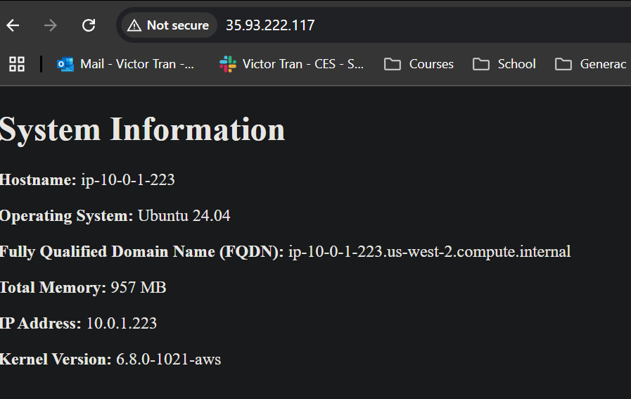

# lab-week7-ansible

### Commands used
- ssh-keygen -f ~/.ssh/aws
    - creates aws keypair
    - stores it in ~/.ssh dir
- ansible-playbook -i inventory/hosts.yml playbook.yml
    - specify our inventory (hosts.yml) with -i
    - specify the playbook to run on inventory (playbook.yml)

### Screenshot of rendered html

